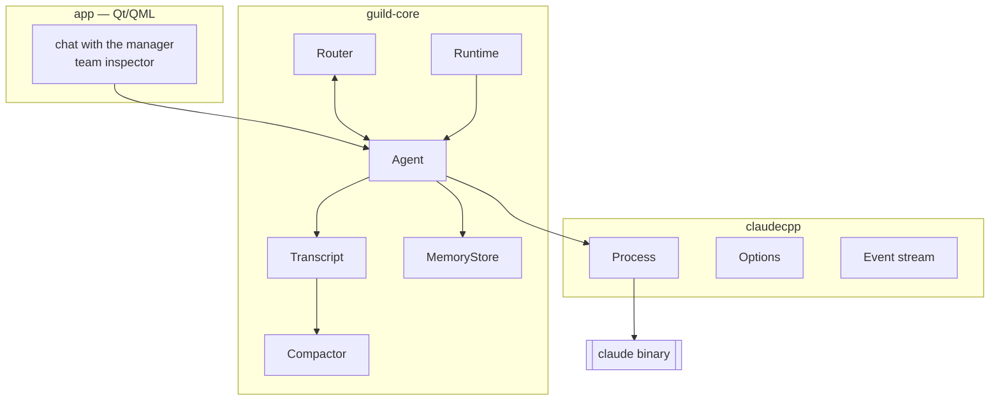

# Guild — the idea

> Loose thinking, not a specification. Nothing here is binding: where a better
> answer shows up, the better answer wins and this file gets rewritten.
>
> One standing rule overrides everything below — **start from what Claude Code
> already does.** Its file formats, directory layout and flags are the default,
> because they come from people who measured what works. Guild invents a format
> only where Claude Code has none, and the invention has to be argued for.
>
> The rule is a starting point, not obedience. Claude Code solves a different
> problem: one human session, with subagents as short-lived helpers that die
> with it. Guild's agents outlive the invocation and own their transcripts. So
> for anything borrowed, ask first whether the assumption behind it still holds
> here. Borrow the format; check the model.

## The pitch

You open one chat window. You talk to a single agent — the manager. Behind it
stands a team you assembled: a researcher, a reviewer, someone who knows the
build system. The manager decides who does what, hands out the work, collects
the answers, and comes back to you with one coherent reply.

You never manage the team. You manage the manager.

## Why this needs to be a framework

Driving the `claude` CLI once is a shell script. Everything interesting starts
after that:

- **Agents outlive a single invocation.** An agent that forgets everything
  between turns is a prompt, not an agent. It needs a transcript it owns.
- **Context runs out.** Long-lived agents must compact themselves without
  losing the thread, automatically, without the user ever asking.
- **Memory is not context.** What an agent knows must survive compaction. That
  means a store that lives outside the context window and gets pulled back in
  on demand.
- **Agents must talk to each other.** Not through the user, and not by pasting
  transcripts. A real message goes from one agent to another, is queued, and
  gets answered.

None of that is a wrapper concern. That is a runtime.

## Architecture

Three layers, three targets. The boundary between them is load-bearing.

**`claudecpp`** — spawns the binary, writes stdin, parses `stream-json` off
stdout, emits typed events. It knows nothing about agents, teams, or memory.
The test of this boundary: it should be extractable and publishable as a
standalone library with no edits.

**`guild-core`** — the runtime. Agents, their transcripts, compaction, memory,
routing, scheduling. Knows nothing about the UI.

**`app`** — the chat window and the team inspector. Qt/QML.

## The vocabulary

| Type | Responsibility |
|---|---|
| `Agent` | Identity, role, system prompt, its own transcript and mailbox |
| `Transcript` | The full turn history. The source of truth for one agent |
| `Compactor` | Strategy interface: how a transcript gets shortened |
| `MemoryStore` | Durable knowledge that survives compaction |
| `Envelope` | One message from agent to agent: `from`, `to`, `payload` |
| `Router` | Delivers envelopes into mailboxes |
| `Roster` | Who is on the team, and who reports to whom |
| `Runtime` | The loop: who runs now, how many run at once |

Two naming rules worth stating up front, because breaking them is expensive
later:

**There is no `Manager` class.** The manager is an ordinary `Agent` that holds
a `Roster` and owns a `delegate` tool. If manager-ness were a type, a manager
could never report to another manager — and nested teams are exactly where
this is going.

**A turn is not an envelope.** `Turn` is an entry in a conversation. `Envelope`
is a letter between agents. Calling both `Message` collapses two different
lifetimes into one type.

## The load-bearing decision: who owns the context

The `claude` binary already keeps sessions on disk and already compacts them
(`--resume`). If `Agent` also keeps a transcript and also compacts, there are
two sources of truth and they will drift.

**Guild owns the context.** The CLI is invoked statelessly
(`-p --output-format stream-json`), and the full transcript, the compaction
strategy, and the memory live in C++.

This is the more expensive path and it is the only one that works, because the
two features that define the project both require writing into the middle of a
context window:

- injecting another agent's reply into an agent's history at the right point
- compacting on our own terms, with our own summary, keeping what memory says
  matters

Leaning on `--resume` would be faster to a first demo and would leave
`Compactor` and `MemoryStore` with nothing to control.

## The loop

1. The user sends a message to the manager.
2. The manager reads its roster, decides on a split, emits `Envelope`s.
3. `Router` drops them into mailboxes. `Runtime` wakes those agents, possibly
   in parallel.
4. Each agent appends the envelope to its own `Transcript`, invokes the binary,
   streams events back.
5. Before each invocation, the agent checks its context budget. Over the line,
   `Compactor` runs first, consulting `MemoryStore` for what must not be lost.
6. Replies travel back as `Envelope`s. The manager assembles them.
7. One answer reaches the user.

## Non-goals

- Not an HTTP client for the Anthropic API. Guild drives the CLI.
- Not a hosted service. It runs locally, on the user's own credentials.
- Not a redistribution of the binary. Users install `claude` themselves; Guild
  locates and runs it.

## Open questions

- **Compaction trigger.** Token estimate before each call, or reactive to the
  binary's own signals? An estimate is cheaper but wrong at the margin.
- **Memory retrieval.** Full-text over SQLite first; embeddings only if plain
  search demonstrably fails.
- **Parallelism.** How many agents may run at once before the account's rate
  limits become the bottleneck rather than the design.
- **Failure semantics.** An agent that crashes mid-delegation — does the
  manager retry, reassign, or surface it to the user?
- **Persistence format.** Transcripts as append-only JSONL per agent, or all
  in SQLite alongside memory?

## Rough order of work

1. `claudecpp`: spawn, stream, parse, typed events. Usable on its own.
2. `Agent` + `Transcript`: one agent, persistent across runs, no team.
3. `Compactor`: automatic, so a single agent can run indefinitely.
4. `MemoryStore`: knowledge that survives step 3.
5. `Router` + `Roster`: two agents talking.
6. `Runtime`: parallelism and scheduling.
7. `app`: the chat window.

Steps 1–4 are worth having even if the project stops there — a single
self-compacting agent with memory is already a useful thing to own.

---

Unofficial project, not affiliated with Anthropic.
